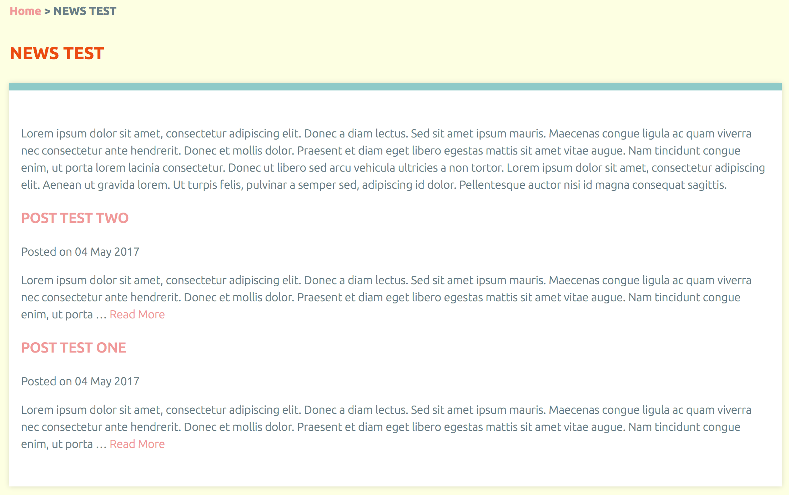

# Blog Shortcode
Allows users to display a list of simple pages in a blog-like format.

## Usage
Create a simple page to use as a "blog" (for example, a page with the title of "News and Events" and the slug "news"). The slug is important because it will be the main way you control which posts appear. Create "blog posts" by adding new simple pages and organizing them as *children* of the chosen "blog" page (for instance, setting the "parent page" to "News and Events"). Add the `[blog]` shortcode to the page you want to serve as your blog. See options below.

## Options
- **parent**: the slug of the parent page whose child pages should be displayed. *String* (default is `current page`)
- **number**: the max. number of child pages to display. *Number* (default is `10`)
- **length**: the length of the text snippet (excerpt) for each child page. *Number* (default is `500`)
- **author**: sets whether to display the name of the user who created the page. *Boolean* (default is `true`)
- **date**: sets whether to display the date the page was created. *Boolean* (default is `true`)

## Example with no options
`[blog]`

Placing this on a simple page will display all children of that page as a blog-styled list, with the most recently-added at the top.

## Example with all options
`[blog parent="news" number="10" length="500" author="false" date="true"]`

This example will diplay the *10* most recent children of the page that has the slug *news*. Each entry will display a *date* in the byline but not an *author* and the text snippet for each entry will be *500* characters long.

## Usage outside of Simple Pages
Theme developers may add support for usage anywhere on their Omeka site. For example, you could create a theme setting called News Widget (as an HTML text area where a user might place the shortcode) and add the following to your homepage or other theme template.

```
<?php
	$t=get_theme_option('News Widget');
	echo $this->shortcodes($t);
?>
```

## Screenshot

